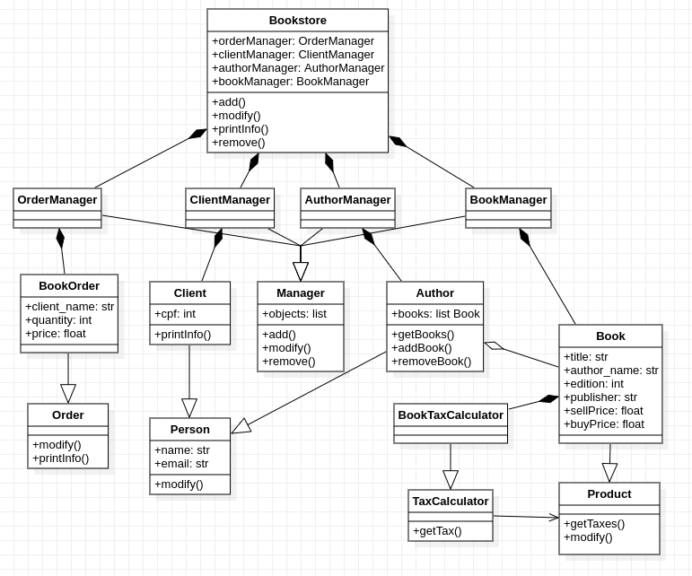

Laboratório CES22 de princípios básicos de OO e princípios SOLID

Para testar a livraria, bata executar:
``` shell
python testBookstore.py
```

Imagens do funcionamento da aplicação encontram-se na pasta `imgs`.

O diagrama de classe da livraria é apresentado a seguir:

